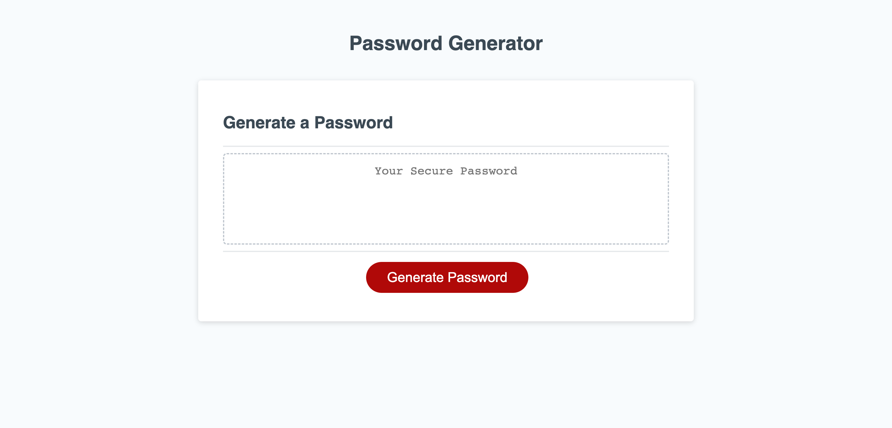

# Random Password Generator
By Brady Billeisen

## Description
For this project I had to refactor the code for an application that will generate a random password, meeting the acceptance criteria given to me. To do this I had to create a generatePassword function, that will take all the character types the user would like in their password, as well as the character length they would like their password to be, and then spits out a completely random password that is the exact length of the user input and meets all the criteria they selected for it. I put notes throughout the entire function to show exactly what code I added, and how it works. If you'd like to see those notes, you can go to [the script](./assets/script/script.js) to see it.

## Acceptance Criteria
```
GIVEN I need a new, secure password
WHEN I click the button to generate a password
THEN I am presented with a series of prompts for password criteria
WHEN prompted for password criteria
THEN I select which criteria to include in the password
WHEN prompted for the length of the password
THEN I choose a length of at least 8 characters and no more than 128 characters
WHEN asked for character types to include in the password
THEN I confirm whether or not to include lowercase, uppercase, numeric, and/or special characters
WHEN I answer each prompt
THEN my input should be validated and at least one character type should be selected
WHEN all prompts are answered
THEN a password is generated that matches the selected criteria
WHEN the password is generated
THEN the password is either displayed in an alert or written to the page
```

## Visual


## Resources
[Deployed Site](https://brady-billeisen.github.io/password-generator/)

[GitHub Repository](https://github.com/brady-billeisen/password-generator)

## License
For this project I used an MIT license.
